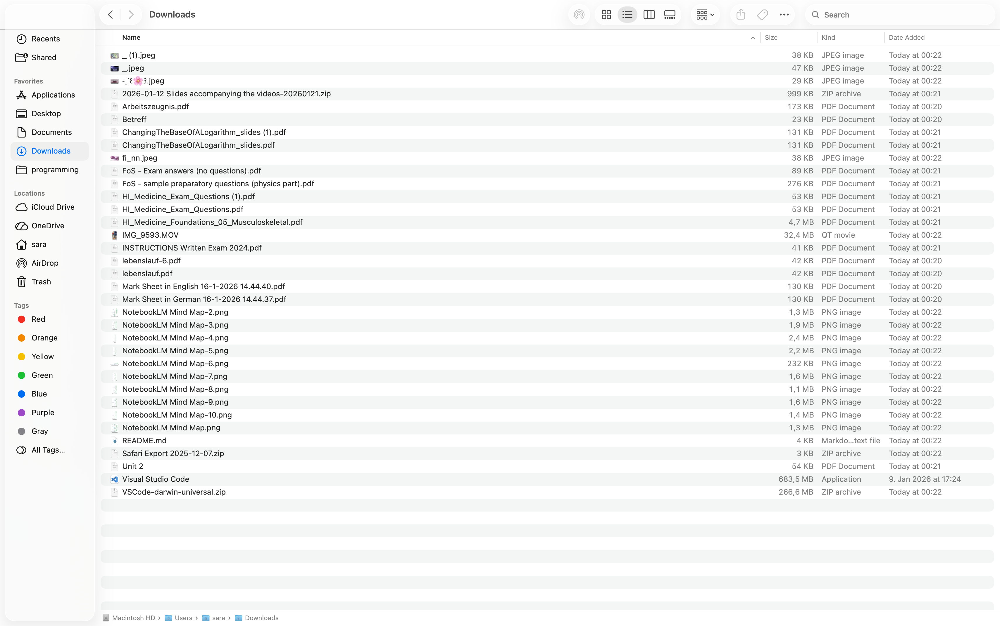
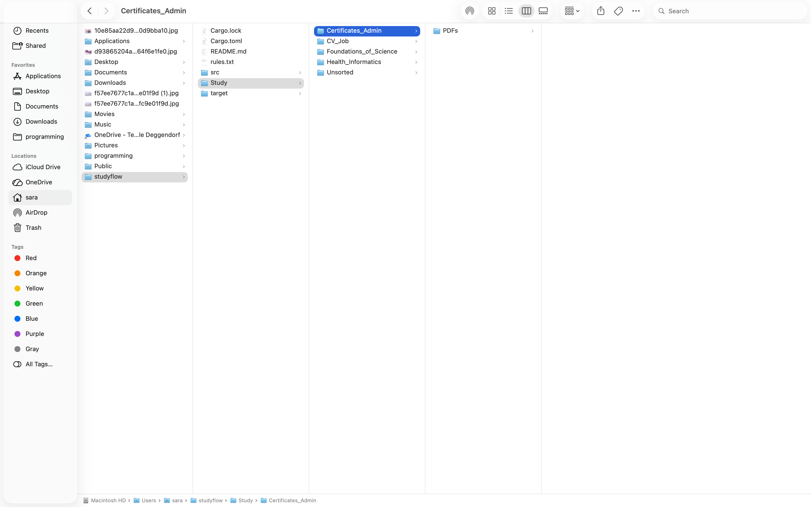

# StudyFlow

  <a href="https://sara-hzz.github.io/" target="_blank">
    🌐 View Live Website
  </a>

A rule-based CLI file organizer built in Rust.
Designed to automate messy folders and improve structured digital workflows.

### Overview

StudyFlow scans a selected directory (e.g., Downloads), applies custom keyword rules, detects file types, and automatically builds a clean study-oriented structure.

It was developed as:

. A practical automation tool

. A structured Rust learning project

. A developer workflow optimization experiment

### Problem

Students and developers often accumulate disorganized files in their Downloads folders.

Manual sorting is:

. Repetitive

. Inefficient

. Error-prone

StudyFlow automates this process using customizable rule-based matching.

### Solution

StudyFlow:

. Reads keyword rules from a configuration file

. Matches filenames against defined courses

. Categorizes files by type

. Builds a structured folder system automatically

### Target Structure
Study/<Course>/<FileType>/

Unmatched files are safely placed in:

Study/Unsorted/

### Core Features

. Keyword-based course matching

. Automatic file type categorization (PDFs, Images, Archives, Videos, etc.)

. Safe duplicate handling

. Fallback Unsorted folder

. --dry-run preview mode

. Clean Git structure with proper .gitignore

### How It Works

Rules are defined inside rules.txt using the format:

Course_Name: keyword1, keyword2

Example
Digital_Business: business, marketing
Health_Informatics: HI, medicine

### The Program Workflow

1. Loads rule definitions

2. Scans the input directory

3. Matches filenames against keywords

4. Creates structured folders

5. Moves files safely

## Demo

Before vs After organizing the Downloads folder:

  
  

## Live Terminal Output

  

### Installation

Clone the repository:

git clone https://github.com/sara-hzz/studyflow.git
cd studyflow

Build the optimized release version:

cargo build --release

The compiled binary will be located at:

target/release/studyflow

## Usage
#### Preview changes safely
cargo run -- ~/Downloads --rules rules.txt --dry-run

#### Organize files
cargo run -- ~/Downloads --rules rules.txt

#### Run the optimized release build
./target/release/studyflow ~/Downloads --rules rules.txt

#### Project Structure
studyflow/
 ├── src/
 ├── rules.txt
 ├── assets/
 ├── README.md
 └── Cargo.toml

### Technical Details

. Written in Rust

. Uses std::fs, PathBuf, and io::Result

. Modular CLI argument handling

. Designed as a structured automation tool

### Live Website

Project presentation:
👉 https://sara-hzz.github.io/

# Author

Sara Hany Zarea
Health Informatics Student
Focused on workflow automation and structured digital systems

